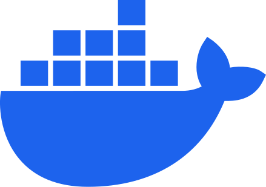

## Hi, I'm Tadeáš 👋
Aspiring fullstack developer and CS student at FI MUNI.

### 🛠️ Primary Tech Stack

    
    
    
    
    
    
    
    

### 👨‍💻 Currently Working On
[MyCloud 2.0](https://github.com/TadeJin/MyCloud-2.0) — a self-hosted cloud storage app built with Next.js, Prisma, PostgreSQL, and Docker.
